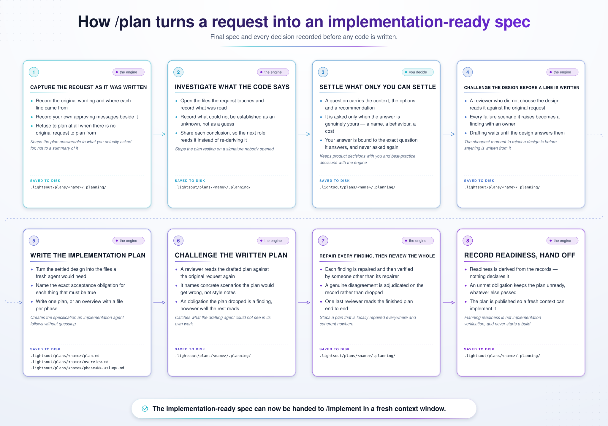
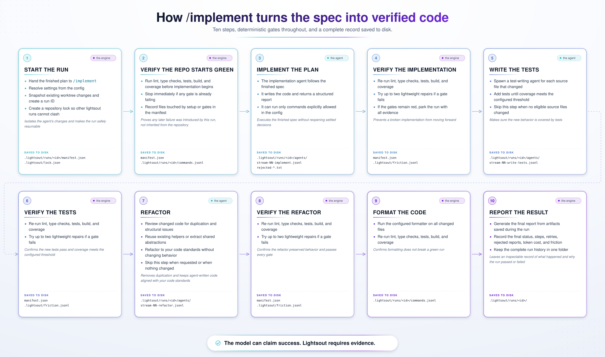

# lightsout

**Stop the slop. Make every decision up front, then walk away.**

Lightsout takes a finished plan and runs it through a gated software factory. Your coding agent implements, tests, and refactors autonomously. Your standards guide how the code is written, while deterministic gates decide whether the work passes.

**Humans make the decisions. Agents execute them. Your commands decide when the work is done.**

**Status: pre-alpha.**

## Why

Coding agents are smart. But without direction, they optimize for the task in front of them, not the long-term shape of the repository.

They solve the immediate problem and move on. They miss an existing helper and write another one. They introduce a second pattern beside an existing one. They copy whatever patterns are nearby, including the shortcuts and bad decisions already hiding in the repo.

Each change may work. The tests may pass. But over time, the repository accumulates duplicate logic, competing abstractions, inconsistent styles, and multiple ways to solve the same problem.

Worse, that degradation compounds. Once a weak pattern enters the codebase, future agents encounter it as precedent and repeat it. The mess becomes part of the context.

Lightsout makes repository quality part of the work, not something left for a human to clean up afterward:

- **Search before writing.** Agents look for existing and similar code before introducing something new.
- **Standards at every step.** Your style guide and architecture rules are injected throughout planning, implementation, testing, and refactoring.
- **Refactoring is mandatory.** Every implementation gets a dedicated cleanup pass before the run can finish.

Completing the task is not enough. Agents should leave the repository better than they found it.

## The lightsout approach

- **Humans decide. Agents execute.** Before implementation begins, you and the planning agent agree on a complete design spec: scope, architecture, files touched, tradeoffs, constraints, and acceptance criteria. Once every decision is settled, the implementation agent follows the plan without guessing or inventing the design as it goes.
- **Makes code standards a first-class concern.** Your style guide and architecture rules are injected into planning, implementation, testing, and refactoring. The agent follows the standards you defined instead of copying whatever patterns it happens to find in the repository.
- **Improves the codebase with every run.** During planning, agents search for existing helpers and similar implementations, then identify where shared abstractions can replace duplicated logic. Every run ends with a mandatory refactoring pass.
- **Puts deterministic gates between every stage.** Lightsout formats the full repository after each code-writing phase, then runs your tests, lint, type checks, and coverage commands directly instead of asking an agent to verify its own work. A red verification family receives a bounded repair allowance of its own before the run escalates.
- **Makes every run auditable.** All gate results, agent conversations, decisions, and costs are recorded in the run manifest. A successful run does not just claim it passed. It can prove it.

## Quick start

1. **Install lightsout.**

   In Claude Code:

   ```text
   /plugin marketplace add dc-devs/lightsout
   /plugin install lightsout@lightsout
   ```

   In Codex:

   ```sh
   codex plugin marketplace add dc-devs/lightsout
   codex plugin add lightsout@lightsout
   ```

   The marketplace also carries optional `lightsout-linear` and `lightsout-jira`
   add-ons. They teach tracker-specific labels, statuses, attachments, and
   pull-request mechanics on top of the base ticket workflow. The queue adapters
   ship in `lightsout`; these add-ons contain only the tracker mechanics:

   ```text
   /plugin install lightsout-linear@lightsout
   /plugin install lightsout-jira@lightsout
   ```

   Or in Codex:

   ```sh
   codex plugin add lightsout-linear@lightsout
   codex plugin add lightsout-jira@lightsout
   ```

   To load the ticket workflow, an adopting repository adds one line to its
   own `CLAUDE.md` (Claude Code) or `AGENTS.md` (Codex) — the same line this
   repository carries:

   ```markdown
   One ticket = one branch = one PR — follow the `ticket-workflow` skill, with `linear-ticket` or `jira-ticket` for tracker mechanics.
   ```

   The command examples below use Claude Code's slash-command form. In Codex,
   ask for the same installed skill by name, such as “use the `plan` skill” or
   “start the `queue` skill.”

2. **Define your standards and gate commands.**

Add a `lightsout.config.json` to the repository with your code standards and validation commands. Only the `gates` commands are mandatory — everything else is optional with sensible defaults. Leave `standards-packs` out and lightsout uses the standards pack it ships with. See [docs/configuration.md](docs/configuration.md) for all available options.

```json
{
  "gates": {
    "check": "pnpm check",
    "test": "pnpm test:unit",
    "test-coverage": "pnpm test:coverage",
    "test-e2e": "pnpm test:e2e",
    "build": "pnpm bundle"
  }
}
```

3. **Design before you build.**

Use `/brainstorm` to pressure-test a rough idea, explore alternative approaches and tradeoffs, and agree on a clear direction before any code is written. The final design is saved and handed to /plan.

4. **Turn the design into an executable spec.**

Use `/plan` to explore the codebase and settle the scope, architecture, files touched, constraints, edge cases, and acceptance criteria. The plan is graded until nothing is left for the implementation agent to guess, invent, or decide on its own.

5. **Hand the spec to the factory.**

Use `/implement`, then walk away. The implementation agent follows the finished spec, writes the code and tests, and performs a mandatory refactoring pass. Deterministic gates verify every stage, and the complete run is recorded in .lightsout/runs/<id>/.

## Commands

### /brainstorm

Design before you build. `/brainstorm` turns a rough idea into a clear direction through dialogue. It asks questions, explores alternative approaches, explains the tradeoffs, and recommends a path forward.

Once the direction is settled, it saves two things — the design write-up, and the list of decisions that were settled, in a form `/plan` honors — and hands them to `/plan`. For small, obvious changes, it can also exit directly to implementation.

```text
/brainstorm add rate limiting to the public API
```

### /plan

Turn the design into an executable spec. `/plan` explores the codebase, searches for existing helpers and similar implementations, and works through the scope, architecture, files touched, constraints, edge cases, abstractions, and acceptance criteria.

The plan is graded and revised until nothing is left for the implementation agent to guess, invent, or decide on its own.

When a plan starts from a `/brainstorm` hand-off, the decisions already settled there are carried straight into the plan rather than asked again; a settled decision is re-opened only when exploring the code turns up a concrete conflict.

Once a ticket-backed plan is approved as ready, run `lightsout plan publish --name <name>`. It attaches only the durable design record — the single or
phased plan deliverable and whichever of `notes.md`, `decisions.json`, and
`grade.json` the folder holds — plus a small `plan-attachments.json` integrity
marker written last. Transcripts and other run state stay local. Publishing
again replaces each same-titled attachment, so an amended plan can be published
safely without creating duplicate attachments under those names.

[](assets/plan-workflow-light.svg)


Start from the notes `/brainstorm` saved:

```text
/plan .lightsout/plans/rate-limiting/notes.md
```

Or start from a plain description:

```text
/plan add rate limiting to the public API
```

### /auto-plan

Plan a ticket without the interview. `/auto-plan` does the work `/plan` does, but answers the questions itself — every question that falls below a written escalation bar. It stops only for the ones two reasonable engineers would answer differently.

It then shows one proposal, carrying a digest of every question it answered for itself. Any of those answers can be vetoed there.

What happens after you approve — stop at the hand-off line, or start the build — is the `auto-plan` config block's decision. Reach for it when the ticket is shaped enough that you would answer most of the interview with "you decide".

```text
/auto-plan LO-64
```

### /implement

Hand the finished spec to the factory. `/implement` follows the plan, writes the code and tests, and performs a mandatory refactoring pass.

After each code-writing stage, the full repository is formatted before deterministic gates run. If a test, lint, type-check, coverage, build, or formatting family fails, that family receives bounded repair attempts before the run escalates; root and package executions of the same family share the allowance. When the run succeeds, the complete record is written to `.lightsout/runs/<id>/`.

A finished plan is not stuck on the machine that wrote it. `/implement` looks
for the plan folder on local disk first. When a ticket-named folder is absent,
it fetches that ticket's durable plan attachments and reconstructs the folder,
so a fresh clone can run the same plan without copying files by hand. The
integrity marker must name a complete generation and match every file's hash;
an interrupted or mixed publish is refused without leaving a partial folder.
It never restores transcripts or other run state. If neither source can supply
a plan, the run stops with one message naming both places it looked.

[](assets/implement-workflow-light.svg)

```text
/implement .lightsout/plans/rate-limiting/plan.md
```

### lightsout status

List every recorded run with `lightsout status`, or open one run's detailed progress block with its full or shortened id:

```text
lightsout status --run <id>
lightsout status --run <id> --watch
```

`--watch` refreshes the detailed block until the run stops. A failing verification row shows its gate families, root/package groups, per-family repair counts, whether a supervisor-guided repair ran, the supervisor diagnosis when present, and the final output line. The complete command, exit code, timing, and output-tail history remains in `.lightsout/runs/<run-id>/commands.jsonl`.

### lightsout ship

Take a committed branch from where it stands to merged and cleaned up. `lightsout ship` pushes the branch, opens or adopts the pull request, waits for the checks, merges, deletes the branch and syncs the default branch — then writes one JSON result a tracker skill can read.

It has no slash command of its own. Its house conventions — the branch pattern that carries a ticket reference, the pull request body, the merge method, and whether a passed `/implement` run chains straight into it — live in the `ship` config block. See [Configuration](docs/configuration.md).

```text
lightsout ship
```

### lightsout ticket-state

Write a ticket's planning status, its tracker workflow status, or both. The
planning status says what preparation the ticket still owes — it needs
brainstorming, it needs a plan, it is ready for the autonomous planner, its
shaping is complete, or it never needed any. The tracker status says where
implementation stands.

The workflow skills call it at each transition, so the tracker says the same
thing however the work was started. The tracker status is named by role rather
than by your workflow's own spelling, so one line works in every repository; the
names those roles resolve to live in the `queue` config block. See
[Configuration](docs/configuration.md).

```text
lightsout ticket-state --ref LO-88 --planning-status planning-complete --tracker-status ready
```

### lightsout queue

Drain the backlog lights-out. `lightsout queue` reads the configured Linear team
or Jira project for every ticket whose planning status and tracker status form
one of three pairs, then works them in parallel git worktrees — one branch, one
PR, one merge per ticket.

The planning-status label is how a human opts a ticket in, and the pair names the worker. `planning-ready-auto-plan` in Backlog plans the ticket first — the same self-answering planner behind `/auto-plan` — and then implements the plan it wrote. `planning-complete` in Ready to implement builds the plan already published to the ticket, and `planning-not-needed` in Ready to implement builds straight from the ticket body. The planning status says what preparation a ticket still owes, the tracker status says where implementation stands, and the queue takes only the combinations where both agree the work is ready.

Each ticket gets a fresh worktree cut from the default branch, the config's `setup` command, and a harness run, with up to `max-parallel` tickets in flight at once. The queue moves a ticket to In Progress before its worker touches source and to Done once a merge is confirmed, and it reconciles a ticket whose branch already merged rather than building it again. A ticket blocked by another ticket that is not finished is not picked up: it is left behind with the blocker named. The queue drains everything unblocked, merges the ready branches one at a time, then re-reads the tracker and takes whatever the finished work just unblocked — so a chain of dependent tickets ships in order, in one run. It stops when a re-read finds nothing new.

When a worker hits a question only a human can answer, the queue relays it: to your terminal by default, or — with `--file-relay` — to a mailbox the `queue` skill watches from a Claude Code or Codex session, so you can keep working and answer when asked. A question nobody answers parks its ticket after `question-timeout`; a later run picks parked work back up, worktree and all.

Exit codes carry the whole story: `0` — everything eligible shipped; `2` — work remains that a re-run picks up (parked or left-behind tickets); `1` — the queue refused to start, and the message says why.

It needs two blocks in `lightsout.config.json`: `ticket-tracker` holds the
provider-specific connection and names its credential environment variables;
`queue` holds planning statuses, tracker statuses, labels, parallelism, and
timeouts. See
[Configuration](docs/configuration.md).

```text
lightsout queue --file-relay
```

### /refactor

Turn existing technical debt into a gated refactoring run. `/refactor` runs the standards checks for duplicated logic, oversized files, structural violations, the shape of your test files, where folders and files sit and what they are called, and opportunities to replace repeated code with shared abstractions.

By default, it checks the entire repository. Use --path to target a specific directory and --max-batches to limit how many refactoring batches it completes. Agents fix each batch, and your deterministic gates verify the changes before the run continues.

Before each batch, an agent also reads the judgment-only rules against that batch's files and hands its findings to the fixing agent as advice. Use --code-checks to skip that review and run against the deterministic checks alone — faster and cheaper when the findings are mechanical.

A run normally demands a clean tree, so the ending diff is entirely the run's. Use --allow-dirty to accept uncommitted changes instead: they are recorded in the manifest as baseline and never attributed to a batch, which lets runs stack while you hold off committing. The pre-flight gates still have to pass either way.

Verified changes remain in your worktree for review and commit, and the complete record is written to `.lightsout/runs/<id>/`.

```text
/refactor --path <subdir> --max-batches <n>
```

### Working with your standards

Three commands answer questions about the standards themselves, rather than about your code.

`lightsout standards-check` reports what your repository breaks today. It has two halves and runs both by default: the checks your rules ship as code, and an agent reading the rules no code can check. `--code-checks` runs only the first, `--agent-review` only the second. The agent's findings are always advice — they never fail a run. A run including the code checks writes its report to `.lightsout/standards-check.json`; a review-only run prints and writes nothing, leaving that file as the last real check left it.

`lightsout standards-validate` runs every check in a standards pack against its own pass and fail fixtures. It is the gate to run while writing a rule: a check that lets its fail fixture through catches nothing, and one that flags its pass fixture cries wolf.

`lightsout standards-health` reports on the rules themselves — which are checked by code, which are left to judgment, and how often agents declined each one's findings, with the reasons they gave. The counts come from the refactor runs recorded in `.lightsout/runs/`, so a repository with no history still gets the coverage half.

```text
lightsout standards-check --code-checks
lightsout standards-validate
lightsout standards-health
```

## Documentation

- [Configuration](docs/configuration.md)
- [Monorepos](docs/monorepos.md)

## License

[MIT](LICENSE)
